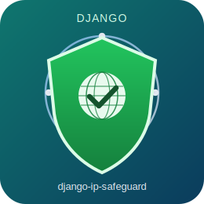

# Django IP 风险拦截插件：企业级开发与发布指南

<div align="center">
  
</div>

<p align="center">
  
  
  
</p>

本文档用于统一说明 `django-ip-safeguard` 的功能边界、配置方式、开发流程与发布流程，面向研发、运维与发布人员。

## 📚 目录

- `🎯 1. 项目定位与命名`
- `🧩 2. 功能说明（全量）`
- `⚙️ 3. 配置文档（完整）`
- `🏗️ 4. 实现方案与结构设计`
- `🚀 5. 开发流程与工作清单`
- `🔐 6. 安全与运维建议`
- `📦 7. PyPI 发布流程（详细）`
- `✅ 8. 验收清单`
- `📈 9. 当前进展与下一步`

## 🎯 1. 项目定位与命名

- 项目名（PyPI）：`django-ip-safeguard`
- Python 模块名：`django_ip_safeguard`
- 目标：在 Django 请求进入业务视图前进行 IP 风险识别和地区规则校验，并可对风险 IP 执行封禁与审计。

---

## 🧩 2. 功能说明（全量）

## 2.1 请求前置拦截

- 通过 `IpGuardMiddleware` 在中间件阶段执行安全判断。
- 请求处理顺序：
  1. 解析真实客户端 IP。
  2. 检查封禁缓存。
  3. 命中情报缓存则直接判定。
  4. 未命中则调用 Provider 获取情报并缓存。
  5. 执行风险引擎判定（风险分、标签、地区）。
  6. 放行或拦截；按开关写入审计日志。

## 2.2 IP 情报查询（Provider）

- `dummy`：本地占位实现，便于开发联调。
- `http`：真实 HTTP 风控服务实现，支持：
  - 超时控制
  - 重试次数
  - 指数退避
  - 自定义请求头
  - API Key 注入

## 2.3 缓存与封禁

- Redis 情报缓存：减少外部调用和响应延迟。
- Redis 封禁缓存：命中后直接拦截。
- 封禁支持 TTL，可配置封禁时长。

## 2.4 规则引擎

- 风险分阈值策略（`risk_score >= threshold`）。
- 风险标签黑名单策略（VPN/Tor/Proxy 等）。
- 国家白名单/黑名单策略。

## 2.5 降级策略

- 全局降级：`IP_GUARD_FAIL_OPEN`。
- 路径级降级：
  - `IP_GUARD_FAIL_OPEN_PATH_PREFIXES`
  - `IP_GUARD_FAIL_CLOSE_PATH_PREFIXES`
- 路径策略优先于全局策略。

## 2.6 审计能力

- 可选将访问决策写入数据库模型 `IpAccessLog`。
- 可记录放行/拦截、风险分、地区、原因、请求路径等信息。

---

## ⚙️ 3. 配置文档（完整）

## 3.1 基础配置

- `IP_GUARD_ENABLED`：是否启用插件，默认 `True`
- `IP_GUARD_REDIS_URL`：Redis 地址，默认 `redis://127.0.0.1:6379/0`
- `IP_GUARD_CACHE_TTL`：情报缓存 TTL（秒），默认 `3600`
- `IP_GUARD_BAN_TTL`：封禁缓存 TTL（秒），默认 `86400`
- `IP_GUARD_BLOCK_STATUS_CODE`：拦截状态码，默认 `403`
- `IP_GUARD_USE_DB_LOG`：是否写数据库审计日志，默认 `False`
- `IP_GUARD_ENABLE_POLICY_CENTER`：是否启用数据库策略中心，默认 `True`
- `IP_GUARD_POLICY_CACHE_SECONDS`：策略缓存秒数，默认 `30`
- `IP_GUARD_IP_MASK_ENABLED`：审计日志 IP 脱敏开关，默认 `True`
- `IP_GUARD_IP_MASK_KEEP_PREFIX`：审计日志 IP 脱敏保留段数，默认 `2`

## 3.2 Provider 配置

- `IP_GUARD_PROVIDER`：`dummy` / `http`
- `IP_GUARD_PROVIDER_ENDPOINT`：HTTP Provider 接口地址
- `IP_GUARD_PROVIDER_API_KEY`：API 密钥（建议环境变量注入）
- `IP_GUARD_PROVIDER_TIMEOUT`：请求超时，默认 `3.0`
- `IP_GUARD_PROVIDER_MAX_RETRIES`：最大重试次数，默认 `2`
- `IP_GUARD_PROVIDER_RETRY_BACKOFF`：退避基数秒数，默认 `0.2`
- `IP_GUARD_PROVIDER_HEADERS`：附加请求头
- `IP_GUARD_PROVIDER_CIRCUIT_BREAKER_FAILURES`：熔断触发失败次数，默认 `5`
- `IP_GUARD_PROVIDER_CIRCUIT_BREAKER_TTL`：熔断统计窗口秒数，默认 `60`

## 3.3 风险规则配置

- `IP_GUARD_RISK_SCORE_THRESHOLD`：风险分阈值，默认 `70`
- `IP_GUARD_BLOCKED_RISK_TAGS`：风险标签黑名单，默认 `("TOR", "PROXY", "VPN")`
- `IP_GUARD_ALLOWED_COUNTRIES`：国家白名单（配置后只允许名单内国家）
- `IP_GUARD_BLOCKED_COUNTRIES`：国家黑名单
- `IP_GUARD_IP_WHITELIST`：IP 白名单（单 IP 或 CIDR，命中直接放行）
- `IP_GUARD_IP_BLACKLIST`：IP 黑名单（单 IP 或 CIDR；若启用策略中心，以库表 `IpGuardPolicy` 为准）
- `IP_GUARD_RATE_LIMIT_PER_MINUTE`：单 IP 每分钟请求上限，`0` 关闭；依赖 Redis 计数

## 3.4 代理与降级配置

- `IP_GUARD_TRUSTED_PROXY_CIDRS`：受信代理网段，仅在该条件下使用 `X-Forwarded-For`
- `IP_GUARD_FAIL_OPEN`：Provider 异常时全局默认是否放行
- `IP_GUARD_FAIL_OPEN_PATH_PREFIXES`：强制放行路径前缀
- `IP_GUARD_FAIL_CLOSE_PATH_PREFIXES`：强制拦截路径前缀
- `IP_GUARD_DEDUPE_LOCK_SECONDS`：并发查询去重锁秒数，默认 `3`
- `IP_GUARD_HIGH_RISK_CACHE_TTL`：高风险缓存秒数，默认 `7200`
- `IP_GUARD_LOW_RISK_CACHE_TTL`：低风险缓存秒数，默认 `1800`

## 3.5 生产配置示例

```python
import os

IP_GUARD_ENABLED = True
IP_GUARD_REDIS_URL = "redis://127.0.0.1:6379/0"
IP_GUARD_CACHE_TTL = 3600
IP_GUARD_BAN_TTL = 86400

IP_GUARD_PROVIDER = "http"
IP_GUARD_PROVIDER_ENDPOINT = "https://risk-api.example.com/ip/query"
IP_GUARD_PROVIDER_API_KEY = os.getenv("IP_GUARD_PROVIDER_API_KEY", "")
IP_GUARD_PROVIDER_TIMEOUT = 2.5
IP_GUARD_PROVIDER_MAX_RETRIES = 2
IP_GUARD_PROVIDER_RETRY_BACKOFF = 0.2
IP_GUARD_PROVIDER_CIRCUIT_BREAKER_FAILURES = 5
IP_GUARD_PROVIDER_CIRCUIT_BREAKER_TTL = 60
IP_GUARD_PROVIDER_HEADERS = {"X-Source": "django-ip-safeguard"}

IP_GUARD_RISK_SCORE_THRESHOLD = 70
IP_GUARD_BLOCKED_RISK_TAGS = ("TOR", "VPN", "PROXY")
IP_GUARD_ALLOWED_COUNTRIES = ("CN", "SG")
IP_GUARD_BLOCKED_COUNTRIES = ()
IP_GUARD_IP_WHITELIST = ("127.0.0.1",)

IP_GUARD_FAIL_OPEN = True
IP_GUARD_FAIL_OPEN_PATH_PREFIXES = ("/health", "/public")
IP_GUARD_FAIL_CLOSE_PATH_PREFIXES = ("/api/login", "/api/pay")
IP_GUARD_TRUSTED_PROXY_CIDRS = ("10.0.0.0/8", "172.16.0.0/12")
IP_GUARD_DEDUPE_LOCK_SECONDS = 3
IP_GUARD_HIGH_RISK_CACHE_TTL = 7200
IP_GUARD_LOW_RISK_CACHE_TTL = 1800

IP_GUARD_BLOCK_STATUS_CODE = 403
IP_GUARD_USE_DB_LOG = True
IP_GUARD_ENABLE_POLICY_CENTER = True
IP_GUARD_POLICY_CACHE_SECONDS = 30
IP_GUARD_IP_MASK_ENABLED = True
IP_GUARD_IP_MASK_KEEP_PREFIX = 2
```

## 3.6 企业 Dashboard 路由接入

在项目 `urls.py` 中挂载插件管理入口：

```python
from django.urls import include, path

urlpatterns = [
    path("ip-guard/", include("django_ip_safeguard.urls")),
]
```

可用接口：

- `/ip-guard/`：Dashboard 页面
- `/ip-guard/api/dashboard/`：运营统计（含 24h 拦截率、决策分布、按小时趋势、热门路径、拦截原因 Top 等）
- `/ip-guard/api/recent-records/`：近若干天（`days`，默认 7、最大 30）攻击/拦截记录、IP 访问记录、按日放行与拦截汇总、近期封禁；可选 `attack_limit`、`access_limit`、`ban_limit`（默认 100、100、40，各自有上限）
- `/ip-guard/api/policy/`：策略读取/更新（GET/POST，含 IP 白/黑名单、地区白/黑名单、单 IP 每分钟请求上限等）
  - 地区白/黑名单仅支持两位国家码（如 `CN`/`US`），写入时自动大写去重
  - IP 白/黑名单支持单 IP 与 CIDR（如 `203.0.113.8`、`10.0.0.0/8`），写入时会规范化并去重
- `/ip-guard/api/ban/`、`/ip-guard/api/unban/`、`/ip-guard/api/ban-list/`：封禁与分页列表（支持 `q`、`active`、`source`）
- `/ip-guard/api/access-logs/`：审计分页（支持 `decision`、`country`、`path`、`q`、`start`/`end` 日期 `YYYY-MM-DD`）
- `/ip-guard/api/access-logs/export/`：按相同筛选条件导出 CSV（最多 1 万条，需 staff；Session 凭 Cookie，JWT 凭 `Authorization: Bearer`）
- `/ip-guard/api/health/`：健康状态（含 Redis 延迟、Provider 熔断失败计数）
- `/ip-guard/api/auth/jwt/login/`、`/ip-guard/api/auth/jwt/refresh/`、`/ip-guard/api/auth/jwt/logout/`：JWT 登录、刷新与退出（Bearer）

## 3.7 Vue3 控制台接入

前端目录：`frontend-admin/`  
技术栈：Vue3 + Vite + Element Plus + Pinia + Axios

启动命令：

```bash
cd frontend-admin
npm install
npm run dev
```

联调约定：

- Django：`http://127.0.0.1:8010`
- Vue：`http://127.0.0.1:5173`
- Vite 代理：`/ip-guard/*`、`/admin/*`
- 鉴权：支持 Django Session + CSRF 与 JWT Bearer（接口会优先识别 Session，其次识别 `Authorization: Bearer <token>`）
- 登录页可选 **Session** 或 **JWT**：Session 走 `/api/auth/login/` 建会话；JWT 走 `/api/auth/jwt/login/`，前端将 `access_token` / `refresh_token` 写入 `localStorage`，Axios 请求拦截器自动附加 Bearer；遇 **401** 时用独立客户端调用 `/api/auth/jwt/refresh/`（body：`refresh_token`）静默换新 access 后重试一次
- 退出：依次尝试 Session `/api/auth/logout/` 与 JWT `/api/auth/jwt/logout/`（均为 CSRF 保护 POST），并清除本地 JWT；纯 JWT 无 Session 时忽略 logout 401
- 审计 CSV 导出使用直连 `axios`（非 JSON 封装实例），JWT 模式下需同样携带 Bearer（已与登录态对齐）
- 所有管理 API 均显式使用 `csrf_protect`（除 Token 下发接口外）；POST/PUT/PATCH/DELETE 必须带有效 CSRF Token
- 用户信息：`/api/auth/me/` 返回 `groups` 与 `permissions`，用于前端菜单与路由鉴权
- 仪表盘「近几日攻击与访问」：调用 `/api/recent-records/`，展示区间汇总、按日表格、最新拦截样本、最新全量访问样本、近期封禁
- 仪表盘「国际来源」：ECharts 世界地图热力 + 国家/地区 Top 条形图，数据为接口 `country_distribution`（`country_code` 与 GeoJSON 的 `iso_a2` 对齐）；底图数据包 `@surbowl/world-geo-json-zh`（Unlicense）

---


### 3.8 权限模型（用户与组）

管理 API 默认要求 `is_staff=True`，并按权限点校验（用户权限 + 所属组权限统一通过 `has_perm` 生效）：

- `django_ip_safeguard.view_ipaccesslog`：仪表盘、审计日志、近期记录
- `django_ip_safeguard.view_ipguardpolicy`：策略读取、健康状态
- `django_ip_safeguard.change_ipguardpolicy`：策略更新
- `django_ip_safeguard.view_ipbanrecord`：封禁列表
- `django_ip_safeguard.change_ipbanrecord`：手动封禁/解封

建议在 Django Admin 中创建组（如“安全运营只读”“安全策略管理员”），将上述权限分配给组后再给用户加组。

---

## 🏗️ 4. 实现方案与结构设计

## 4.1 模块职责

- `middleware.py`：请求总编排
- `conf.py`：配置读取与默认值
- `services/ip_resolver.py`：真实 IP 提取与代理信任判断
- `services/cache.py`：Redis 缓存读写
- `services/provider_base.py`：Provider 抽象
- `services/provider_http.py`：HTTP Provider 实现
- `services/provider_factory.py`：Provider 构建工厂
- `services/policy_service.py`：策略中心加载与缓存
- `services/ip_matcher.py`：IP 白/黑名单规则匹配（精确与 CIDR）
- `services/risk_engine.py`：规则引擎
- `services/ban_service.py`：封禁写入
- `services/audit_service.py`：审计写库
- `models.py`：审计与封禁模型
- `urls.py` / `views.py`：企业 Dashboard 与策略管理接口

## 4.2 关键设计原则

- 优先缓存，减少第三方依赖抖动对主链路影响。
- Provider 可插拔，避免业务逻辑依赖单一供应商。
- 降级可控，保障关键路径安全策略可按路径差异化执行。
- 审计可开关，平衡性能与可追溯性。

---

## 🚀 5. 开发流程与工作清单

## 5.1 开发前准备

- Python `>=3.9`，Django `>=4.2`，Redis `>=6`
- 安装开发依赖：`pytest`、`pytest-django`、`ruff`、`build`、`twine`
- 准备测试风控 API Key（沙箱）
- 准备示例 Django 项目用于联调

## 5.2 推荐开发节奏

1. 先完成配置与中间件主链路。
2. 再接入 Provider 与缓存。
3. 然后实现规则引擎和降级策略。
4. 最后补齐测试、文档、CI 与发布材料。

## 5.3 每次迭代固定流程

1. 编写或更新规则说明。
2. 实现功能并补齐单测。
3. 执行 `pytest` 与 `ruff`。
4. 更新 `README` 与本指南。
5. 更新 `CHANGELOG`。

---

## 🔐 6. 安全与运维建议

## 6.1 安全建议

- 不在仓库保存 API Key，统一用环境变量或密钥平台。
- 只信任明确代理网段，避免 `X-Forwarded-For` 伪造绕过。
- 关键路径建议设置 `fail-close`，如登录、支付、管理接口。
- 为内部办公出口或监控探针设置白名单，降低误杀风险。

## 6.2 运维建议

- 监控以下指标：
  - Provider 错误率
  - Provider 超时率
  - 缓存命中率
  - 拦截率与误拦率
- 设置告警：
  - Provider 连续失败
  - 拦截率突增
  - Redis 不可用

## 6.3 合规建议

- IP 数据属于敏感数据，建议最小化存储并设定保留周期。
- 审计日志中可按需脱敏存储 IP（如保留网段，掩码尾段）。

## 6.4 企业安全基线建议

- 配置变更需走变更审批与审计留痕。
- 管理接口建议放在内网或通过零信任网关访问。
- 对策略更新接口启用最小权限控制（仅安全管理员角色）。
- 建议定期执行策略回放与误拦复盘，形成安全运营闭环。
- Vue 控制台与 Django API 必须同源或受信跨域，并启用 HTTPS。
- 管理 API 必须通过 `staff/superuser` 权限校验与 CSRF 校验。

---

## 📦 7. PyPI 发布流程（详细）

## 7.1 准备账号与凭据

1. 注册账号：
   - TestPyPI: [https://test.pypi.org/](https://test.pypi.org/)
   - PyPI: [https://pypi.org/](https://pypi.org/)
2. 开启 2FA。
3. 创建 API Token（TestPyPI 与 PyPI 分开）。

## 7.2 构建与校验

```bash
python -m pip install --upgrade build twine
python -m build
python -m twine check dist/*
```

## 7.3 发布到 TestPyPI

```bash
export TWINE_USERNAME=__token__
export TWINE_PASSWORD='pypi-你的TestPyPIToken'
python -m twine upload --repository-url https://test.pypi.org/legacy/ dist/*
```

验证安装：

```bash
pip install -i https://test.pypi.org/simple/ django-ip-safeguard
```

## 7.4 发布到正式 PyPI

```bash
export TWINE_USERNAME=__token__
export TWINE_PASSWORD='pypi-你的PyPIToken'
python -m twine upload dist/*
```

## 7.5 发布备注（实操）

- 推荐顺序：先 TestPyPI，再正式 PyPI。
- 如果出现 `File already exists`，需先修改 `version` 再重新构建上传。
- 发布后检查项目页：`https://pypi.org/project/django-ip-safeguard/`。
- 发布前确认 `README` 可渲染、依赖正确、安装命令可用。

---

## ✅ 8. 验收清单

- [ ] 真实 IP 提取逻辑在代理场景下验证通过
- [ ] Redis 缓存命中与回源逻辑验证通过
- [ ] 风险分、标签、地区规则验证通过
- [ ] `fail-open/fail-close` 路径策略验证通过
- [ ] 审计写库开关验证通过
- [ ] `pytest`、`ruff` 全部通过
- [ ] TestPyPI 与 PyPI 发布成功
- [ ] 企业控制台 URL、权限与审计日志验证通过
- [ ] 高可用能力（熔断/去重锁/分级缓存）验证通过

---

## 📈 9. 当前进展与下一步

已完成：

- Provider 工厂与 HTTP Provider（含重试与退避）
- 中间件接入可配置 Provider
- 路径级降级策略
- 数据库审计写入开关
- 单测与文档基础完善
- Django 管理 API 企业化（统一响应、分页筛选、错误码）
- Vue3 + Element Plus 企业控制台（登录、仪表盘多维度统计与近几日攻击/访问记录、国际来源 ECharts 地图可视化、完整策略表单含 IP 白/黑名单与限流、路径级 fail-open/close 与 DB 审计开关、封禁分页与来源筛选、审计分页/路径/日期/导出 CSV、健康详情）
- Session/CSRF 鉴权联动与前后端联调验证

下一步建议：

1. 增加中间件集成测试（RequestFactory + Redis mock）
2. 增加缓存穿透保护（同 IP 并发去重锁）
3. 增强 Admin 管理能力（批量封禁、快速解封、筛选检索）

